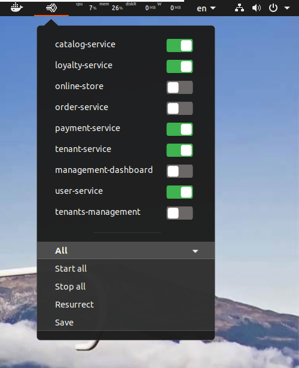

# PM2 Process Manager Gnome Shell Extension
This is a simple toggle on/off extension for starting and stopping processes managed with PM2 (https://pm2.keymetrics.io/).




## Manual Installation
```BASH
# ensure PM2 is available in your `PATH` (or just install it globally)
npm i pm2 -g

# go to your extensions dir
cd ~/.local/share/gnome-shell/extensions

# download extension
git clone https:github.com/alexculea/gnome-shell-extension-pm2-js.git

# rename to UUID
mv gnome-shell-extension-pm2-js pm2-process-manager@bitplot.dev
```
Restart your shell. Alt+F2, type 'r' and Enter. Activate the extension with Gnome Tweaks. If you don't have it, install it with ``sudo apt install gnome-tweaks``.

## Troubleshooting
### Logs
Errors will be logged by the extension in the gnome-shell log. On Ubuntu 19.04 you can see it by running
```journalctl /usr/bin/gnome-shell -f```. Your distro might have a different way of storing the shell logs.
### Can't find NodeJS or PM2 but I have them installed
The extension uses the `PATH` env variable set for the GNOME session using the `~/.profile` or the `~/.bash_profile` files. If you used `~/.bashrc` instead to set your `PATH` for your NodeJS install (such as when using NVM) then this file won't be executed at login so your `PATH` won't contain your NodeJS install location. Make sure to place your bin folders in either `~/.profile` or `~/.bash_profile`. 

For example, in your `~/.profile`:
```BASH
export PATH=$PATH:/path/to/your/node
```

More on what is `PATH`, [here](http://www.linfo.org/path_env_var.html)

## Roadmap
Pull requests welcome.

1.1:
 - ✔ convert shell command running to async (maybe even include it in 1.0?)
 - ✔ fix clicking the panel button  button while the menu is visible makes the menu recreate and flicker
 - ✔ show loading indicator if startup takes more than 0.5s

1.2:
 - don't close menu as soon as toggle is clicked, instead change toggle after command completed and then close the menu
 - add show logs button for each entry, open the gsettings user default terminal instead of hardcoded value
 - ensure status area icon updates when used with a light gnome-shell theme
